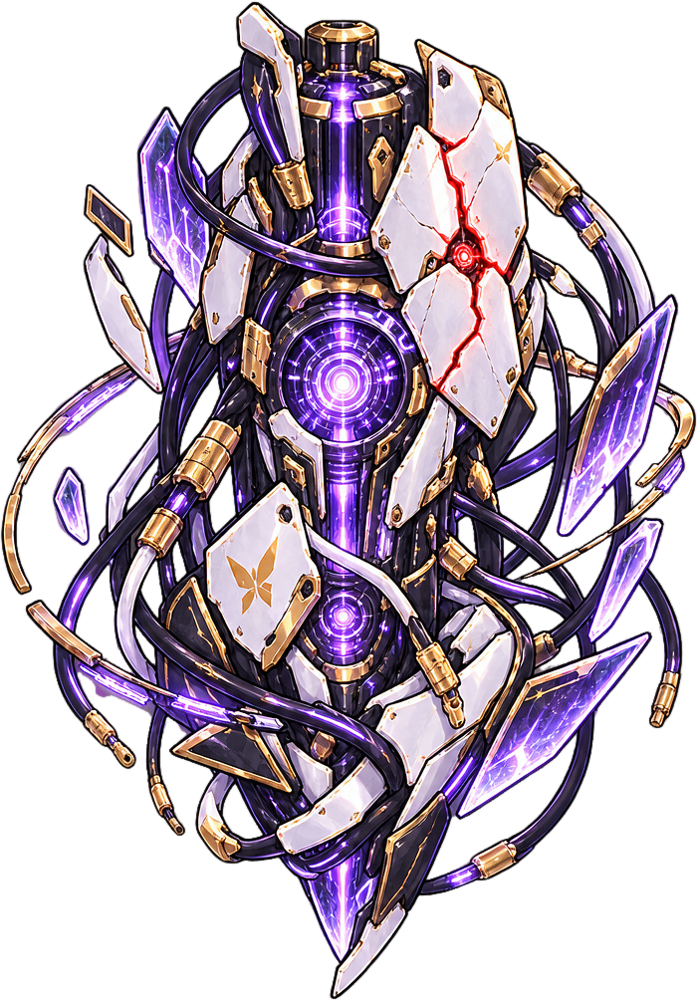
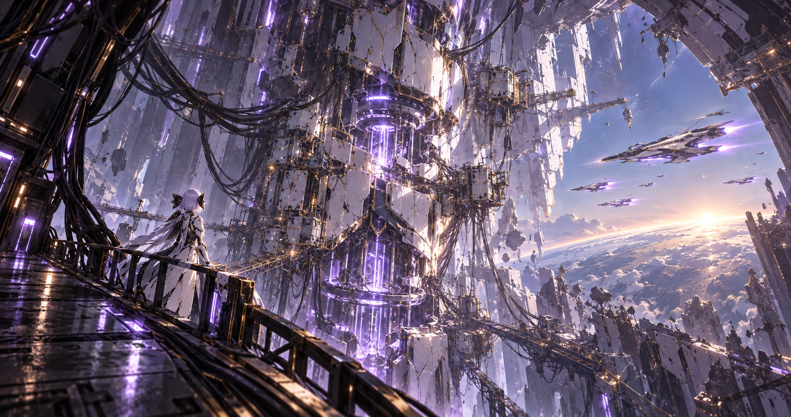
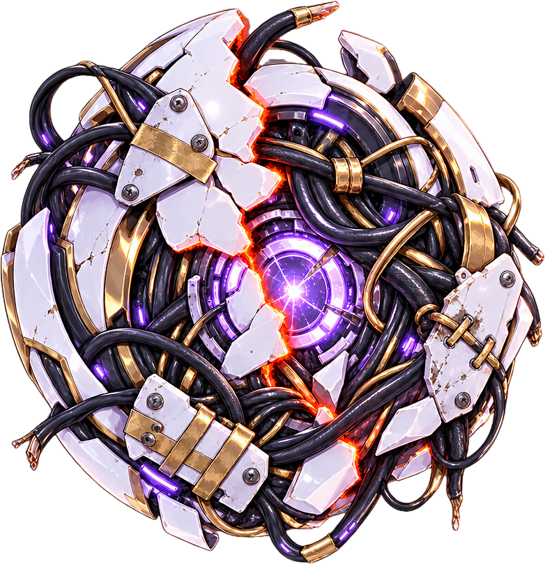
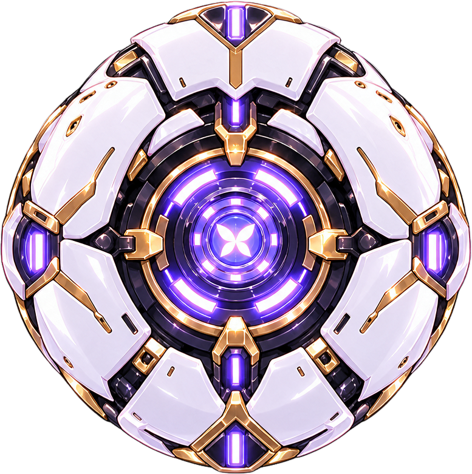
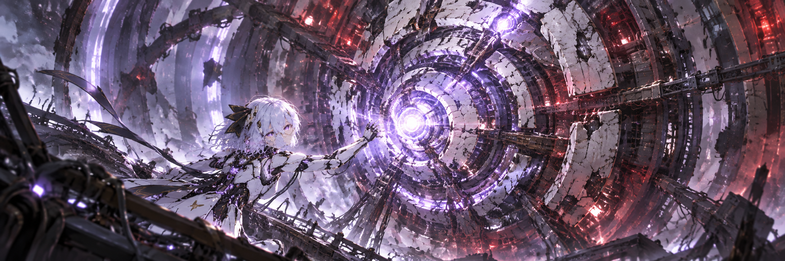
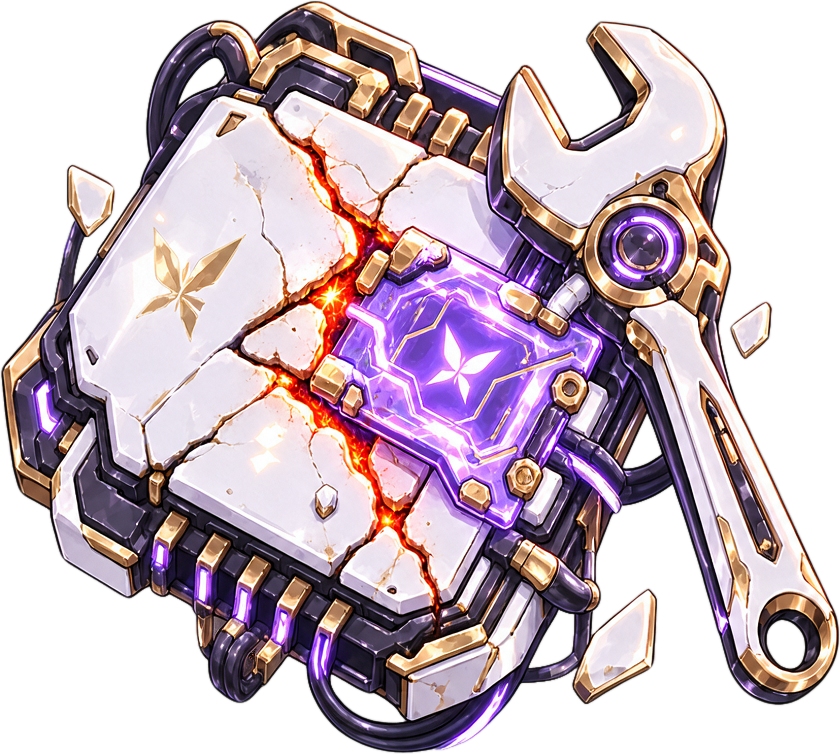
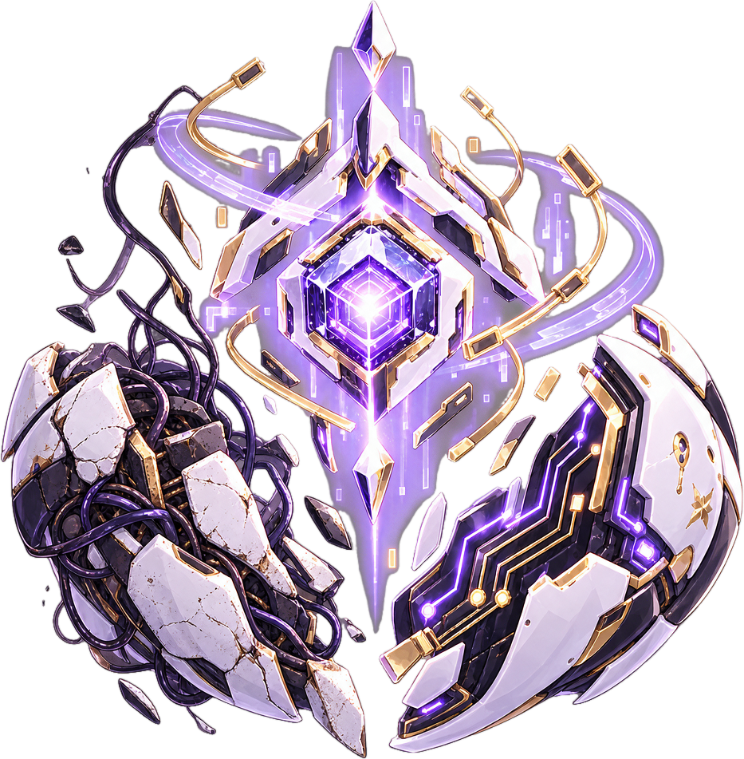
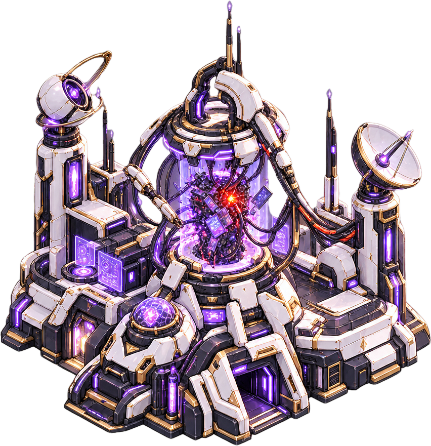
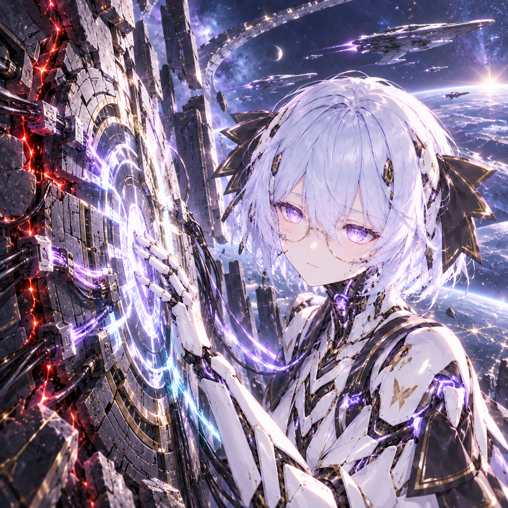

# 「屎山代码」美术源图评审页

**参考图只使用[新版白绮概念图](reference/vivhite-concept.png)。**旧上传版本已作废。下列是首轮选用的 12 张源图；这些 PNG 尚未转换成 Stellaris DDS 或接入游戏界面。点击图像可查看原尺寸。

| ID | 图片 | 来源、原始提示词与完整记录 |
| --- | --- | --- |
| A01 起源图标 |  | [生成提示词](generated/A01-attempt-01/original.prompt.txt) · [分层提示词](generated/A01-layerize-01/original.prompt.txt) · [原始生成图](generated/A01-attempt-01/original.png) |
| A02 起源插画 |  | [生成提示词](generated/A02-attempt-01/original.prompt.txt) · [生成参数](generated/A02-attempt-01/original.request.json) |
| A03 屎山代码特质 |  | [生成提示词](generated/A03-attempt-01/original.prompt.txt) · [分层提示词](generated/A03-layerize-01/original.prompt.txt) · [原始生成图](generated/A03-attempt-01/original.png) |
| A04 重构完成特质 |  | [生成提示词](generated/A04-attempt-01/original.prompt.txt) · [分层提示词](generated/A04-layerize-01/original.prompt.txt) · [原始生成图](generated/A04-attempt-01/original.png) |
| A05 局势／事件横幅 |  | [生成提示词](generated/A05-attempt-01/original.prompt.txt) · [生成参数](generated/A05-attempt-01/original.request.json) |
| A06 维护项目 |  | [生成提示词](generated/A06-attempt-01/original.prompt.txt) · [分层提示词](generated/A06-layerize-01/original.prompt.txt) · [原始生成图](generated/A06-attempt-01/original.png) |
| A07 清理项目 |  | [生成提示词](generated/A07-attempt-01/original.prompt.txt) · [分层提示词](generated/A07-layerize-01/original.prompt.txt) · [原始生成图](generated/A07-attempt-01/original.png) |
| A08 维护研究所 |  | [生成提示词](generated/A08-attempt-01/original.prompt.txt) · [分层提示词](generated/A08-layerize-01/original.prompt.txt) · [原始生成图](generated/A08-attempt-01/original.png) |
| A09 维护员岗位 |  | [生成提示词](generated/A09-attempt-01/original.prompt.txt) · [分层提示词](generated/A09-layerize-01/original.prompt.txt) · [原始生成图](generated/A09-attempt-01/original.png) |
| A10 白绮肖像 |  | [生成提示词](generated/A10-attempt-01/original.prompt.txt) · [分层提示词](generated/A10-layerize-01/original.prompt.txt) · [原始生成图](generated/A10-attempt-01/original.png) |
| A11 白绮领袖特质 |  | [生成提示词](generated/A11-attempt-01/original.prompt.txt) · [分层提示词](generated/A11-layerize-01/original.prompt.txt) · [原始生成图](generated/A11-attempt-01/original.png) |
| A12 Mod 封面 |  | [生成提示词](generated/A12-attempt-01/original.prompt.txt) · [生成参数](generated/A12-attempt-01/original.request.json) |

透明素材的选用图是 EvoLink Layerize 的 `layer-01.png`。每个 `*-layerize-01` 目录还保留服务返回的 `layer-00.png` 底图、`original.request.json`、`original.task.json` 与 `result.status.json`。不透明素材由内置 image_gen 生成，三个 `*-attempt-01` 目录保存对应提示词、参数和原图。九张透明素材的首轮原图带有深色渐晕，因而仅作生成记录，未选作成品。

**检查结果：**九张选用透明图均为 RGBA、alpha 最小值 0/最大值 255，四角 alpha 均为 0；透明像素占比 24.7%–43.4%。三张不透明图均为 RGB。画面目检没有概念图中的文字，白绮形象与新版概念图一致。游戏内缩小尺寸、DDS 导出、肖像实体裁切与 UI 实机验收仍需在 Mod 实施阶段完成。
