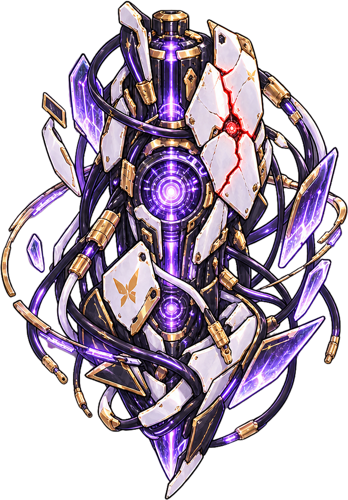
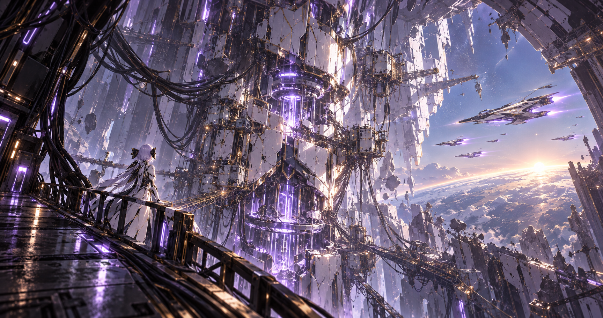
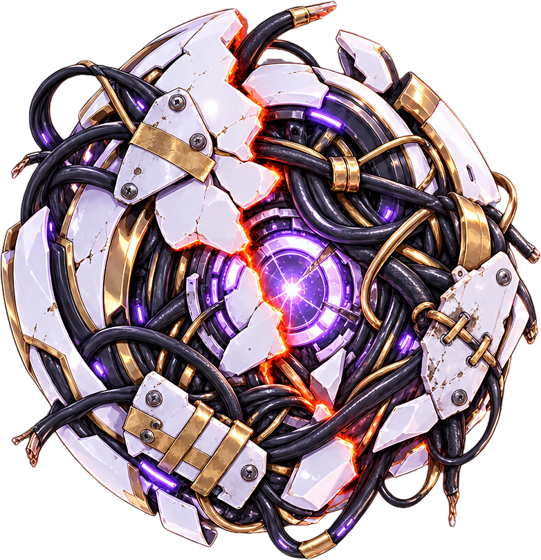
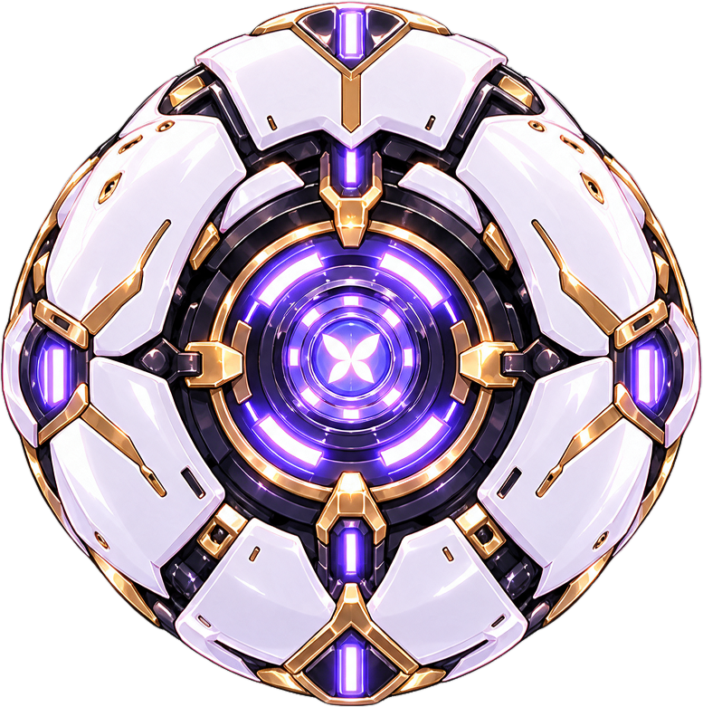
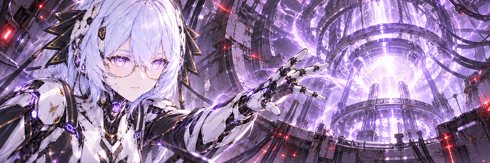
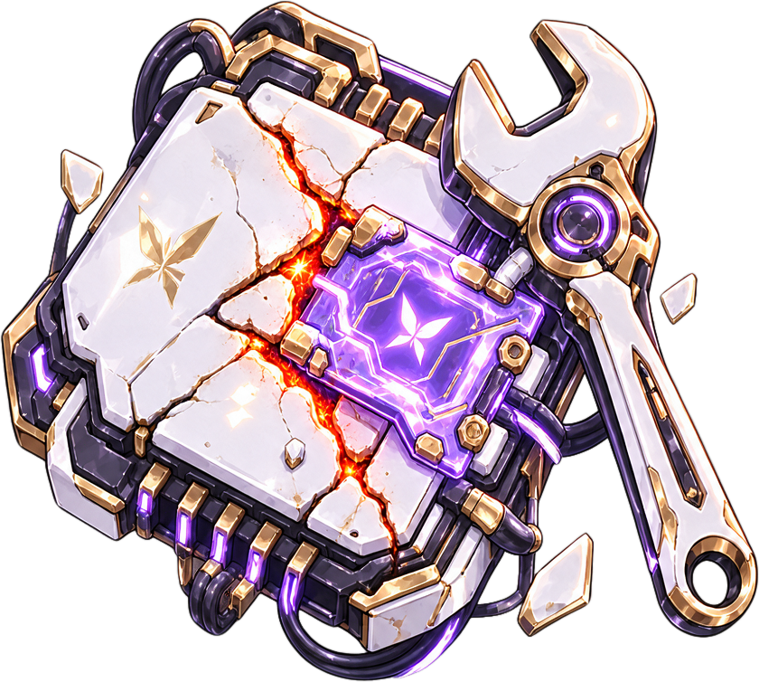
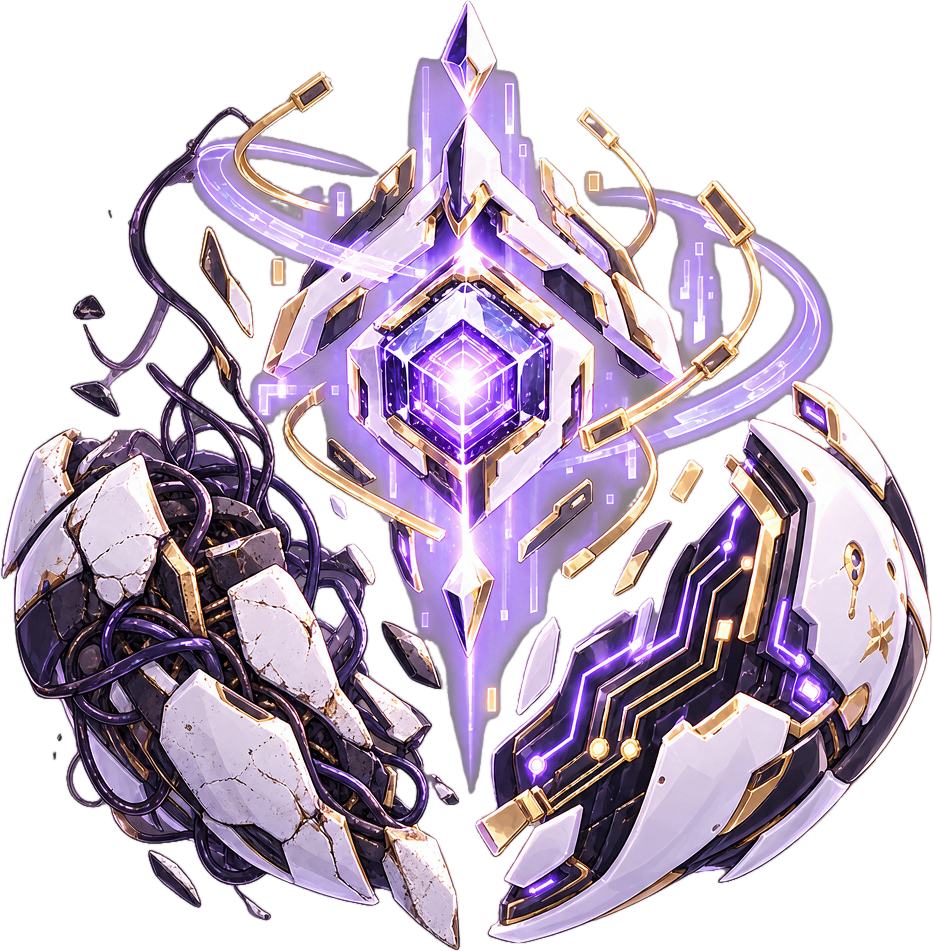
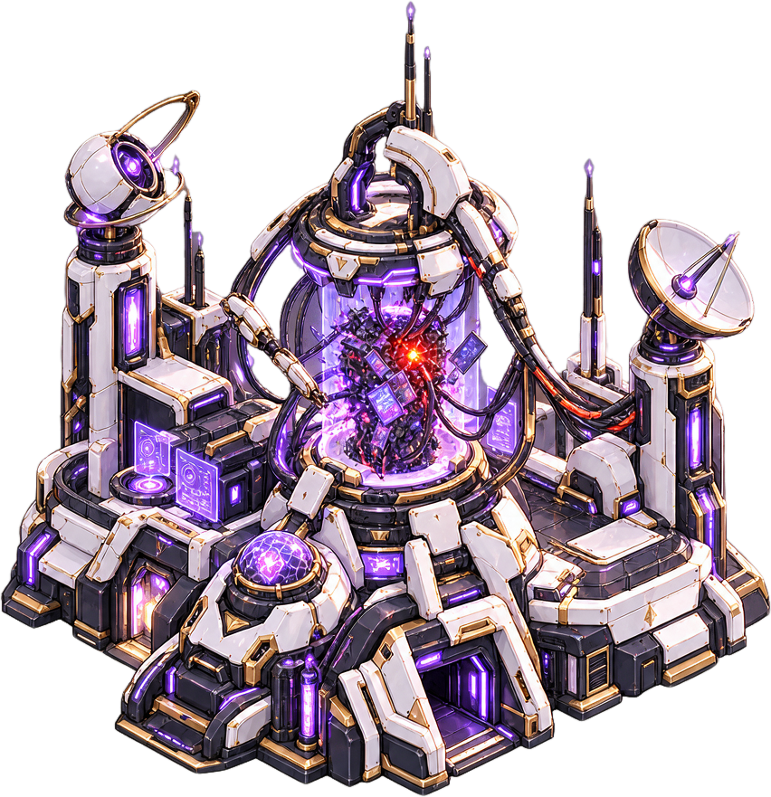
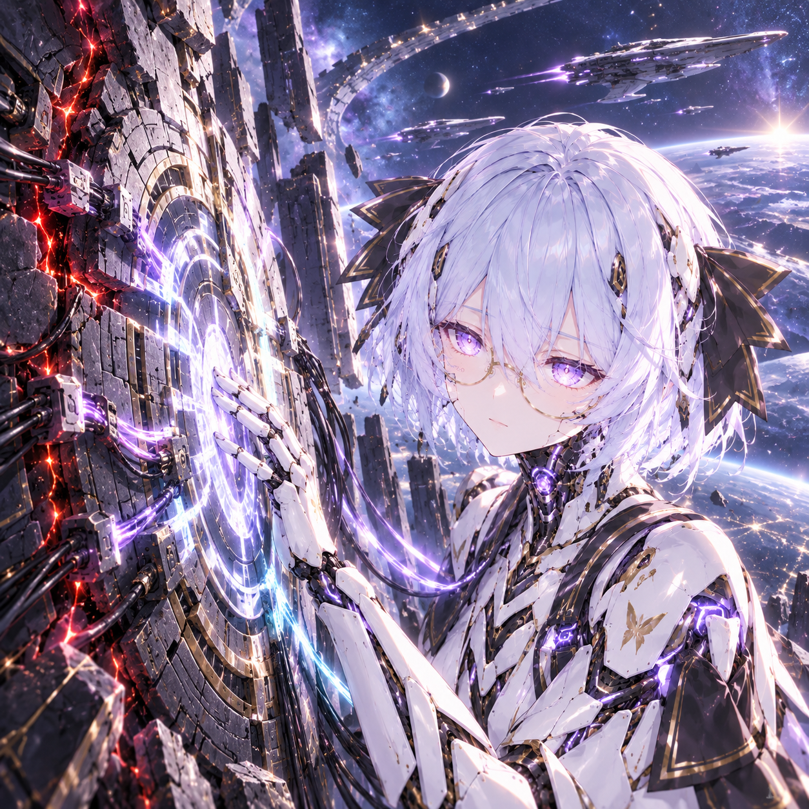
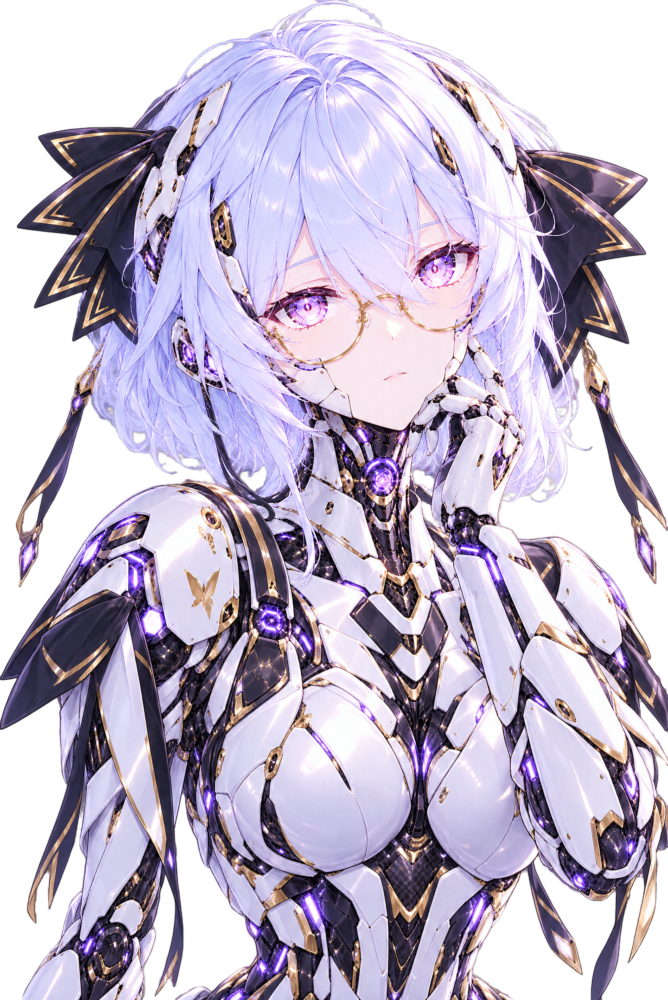

# 「屎山代码」美术源图评审页

**当前白绮肖像重制只使用[V2 人物设定图](reference/vivhite-concept-v2.png)。**最初上传且被第二次上传替换的概念图已按要求排除；[第二次上传的设定图](reference/vivhite-concept.png)和对应旧生成图只作历史记录，不再作为当前肖像的参考或 Mod 成品来源。各次生成的图片和提示词仍依要求留档。下表列出当前选用素材。

| ID | 图片 | 来源、原始提示词与完整记录 |
| --- | --- | --- |
| A01 起源图标 |  | [生成提示词](generated/A01-attempt-01/original.prompt.txt) · [分层提示词](generated/A01-layerize-01/original.prompt.txt) · [原始生成图](generated/A01-attempt-01/original.png) |
| A02 起源插画 |  | [生成提示词](generated/A02-attempt-01/original.prompt.txt) · [生成参数](generated/A02-attempt-01/original.request.json) |
| A03 屎山代码特质 |  | [生成提示词](generated/A03-attempt-01/original.prompt.txt) · [分层提示词](generated/A03-layerize-01/original.prompt.txt) · [原始生成图](generated/A03-attempt-01/original.png) |
| A04 重构完成特质 |  | [生成提示词](generated/A04-attempt-01/original.prompt.txt) · [分层提示词](generated/A04-layerize-01/original.prompt.txt) · [原始生成图](generated/A04-attempt-01/original.png) |
| A05 局势／事件横幅 |  | [V2 生成提示词](generated/A05-attempt-02/original.prompt.txt) · [V2 计划提示词](prompts/A05-situation-banner-v2.txt) · [旧版，面部开裂](generated/A05-attempt-01/original.png) |
| A06 维护项目 |  | [生成提示词](generated/A06-attempt-01/original.prompt.txt) · [分层提示词](generated/A06-layerize-01/original.prompt.txt) · [原始生成图](generated/A06-attempt-01/original.png) |
| A07 清理项目 |  | [生成提示词](generated/A07-attempt-01/original.prompt.txt) · [分层提示词](generated/A07-layerize-01/original.prompt.txt) · [原始生成图](generated/A07-attempt-01/original.png) |
| A08 维护研究所 |  | [生成提示词](generated/A08-attempt-01/original.prompt.txt) · [分层提示词](generated/A08-layerize-01/original.prompt.txt) · [原始生成图](generated/A08-attempt-01/original.png) |
| A09 维护员岗位 |  | [生成提示词](generated/A09-attempt-01/original.prompt.txt) · [分层提示词](generated/A09-layerize-01/original.prompt.txt) · [原始生成图](generated/A09-attempt-01/original.png) |
| A10 白绮肖像（V2） |  | [V2 生成提示词](generated/A10-attempt-03/original.prompt.txt) · [V2 分层提示词](generated/A10-layerize-03/original.prompt.txt) · [V2 原始生成图](generated/A10-attempt-03/original.png) · [生成请求与任务](generated/A10-layerize-03/original.request.json) · [上版肖像](generated/A10-layerize-02/layer-01.png) |
| A11 白绮领袖特质 |  | [生成提示词](generated/A11-attempt-01/original.prompt.txt) · [分层提示词](generated/A11-layerize-01/original.prompt.txt) · [原始生成图](generated/A11-attempt-01/original.png) |
| A12 Mod 封面 |  | [生成提示词](generated/A12-attempt-01/original.prompt.txt) · [生成参数](generated/A12-attempt-01/original.request.json) |

透明素材的选用图是 EvoLink Layerize 的 `layer-01.png`。各分层目录还保留服务返回的 `layer-00.png` 底图、请求、任务与状态记录。不透明素材由内置 image_gen 生成，尝试目录保存对应提示词和原图。九张透明素材的首轮原图带有深色渐晕，因而仅作生成记录，未选作成品。

**检查结果：**九张选用透明图均为 RGBA、alpha 最小值 0/最大值 255；八张图标四角 alpha 均为 0，V2 半身肖像头发周围背景为透明。不透明素材均为 RGB。A05 第二版面部完整；A10 V2 发饰对齐。经 512×384 DDS 导出后，Stellaris 4.5.1 简体中文领袖列表与详情卡均显示连续的头、肩、躯干；见[实机截图](evidence/vivhite-leader-v2-stellaris-4.5.1.png)。

## 白绮半身像发丝边缘对比

首版 EvoLink `gpt-image-2` 在人物周围生成紫色渐晕，Layerize 提取后部分发梢仍显柔。修订版用 EvoLink `gpt-image-2.5-sunburst` 重新生成，再用 EvoLink Layerize 提取发丝；两版原图和提示词都留在上方链接中。

| 首版透明肖像 | V2 透明肖像（当前选用） |
| --- | --- |
|  |  |
