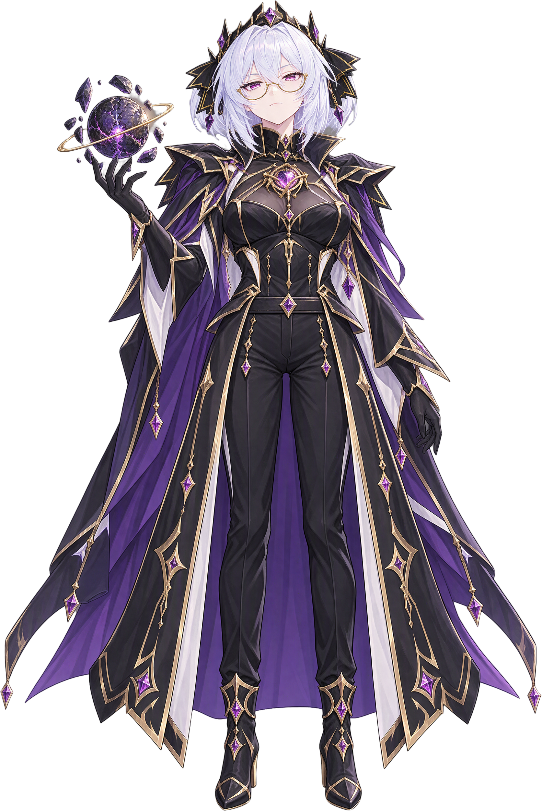

# 女王·白绮：吞噬之心美术审核

V1 已被用户否决：太温柔、太正面。当前方向为邪恶、冷漠、无关生命漠视、异族厌恶、不惜牺牲的果决，以及统治者的霸气和傲气。半身继续使用 V2；全身 V2 腿姿别扭、V3 腿穿出完整裙片、V4 裤裆歪斜，均被要求重做。新全身 V5 重新建立正面躯干与骨盆，使用水平腰头、居中裤前缝与裆点，礼袍前片位于腿外侧。所有图片均由 EvoLink 制作；当前等待用户审核，尚未接入游戏。

| 资产 | 当前透明审核图 | 逐字提示词 | 原始生成、请求与任务 |
| --- | --- | --- | --- |
| 半身肖像 QBA-01 V2 |  | [生成](prompts/QBA-01-portrait-v2.prompt.txt) · [透明提取](prompts/QBA-01-layerize-v2.prompt.txt) | [原图](generated/QBA-01-attempt-02/original.png) · [生成请求](generated/QBA-01-attempt-02/original.request.json) · [生成任务](generated/QBA-01-attempt-02/original.task.json) · [分层任务](generated/QBA-01-layerize-03/original.task.json) |
| 全身立绘 QBA-02 V5 |  | [正面重建](prompts/QBA-02-fullbody-v5-frontal.prompt.txt) · [透明提取](prompts/QBA-02-layerize-v5-frontal.prompt.txt) | [原图](generated/QBA-02-attempt-05/original.png) · [生成请求](generated/QBA-02-attempt-05/original.request.json) · [生成任务](generated/QBA-02-attempt-05/original.task.json) · [分层任务](generated/QBA-02-layerize-05/original.task.json) |

V4 曾检查衣片遮挡，但漏检裤腰、骨盆中线与裆点的歪斜，不能作为通过构图检查的版本。V5 已分别查看原生稿和透明提取成品，检查胸口、腰头、裤前缝与裆点的连接、左右裤腿走向、落脚平面与衣片遮挡：腰头近水平、前缝居中，两条裤腿连续进入各自靴口，袍片在腿外、披风在腿后。此为助手的逐项检查，形象和服装细节仍待用户认可。

透明底由 EvoLink 制作，不使用本地自动抠图。原生输出有灰紫渐晕，因此保留原图并用同服务 Layerize 提取。所有输出层与脱敏请求均留档，不只保存选定层；密钥和临时链接不入库。

半身透明层 1824×2272，全身 V5 透明层 1673×2498，均为 RGBA、alpha 0～255。全身透明像素约 47.26%，四角及抽查的外部背景点为 0；半身下角有身体与披风的自然裁切，按真正的背景区域核查透明而非要求所有角都为 0。V5 原生全身为 1680×2512，带渐晕背景，透明交付使用独立的 Layerize 主体层。Layerize 按主体紧裁，后续正式游戏贴图的留白、统一服饰细节和裁切规格在形象确认后处理。

- [10 张原设清单、尺寸与 SHA-256](reference/manifest.json)
- [人物设定、事件对白与制作记录](../../docs/queen-baiqi-art-direction-2026-10-06.md)
- [V2 事件 CG 提示词方向，尚未生成](prompts/event-cg-directions-v2.md)
- [版本与审核状态清单](review-manifest.json)
- [本轮资产、透明底与检查证据](../../docs/evidence/queen-baiqi-art-check-2026-10-06.json)

V1 的 [半身原图](generated/QBA-01-attempt-01/original.png)、[全身原图](generated/QBA-02-attempt-01/original.png)、[全身透明层](generated/QBA-02-layerize-01/layer-01.png)及对应提示词、请求和任务保留为历史，不再作为当前候选。正式事件 CG 等人物形象审核后制作；本轮没有 Mod 脚本或实机验收。

全身 [V2](generated/QBA-02-attempt-02/original.png)、[V3](generated/QBA-02-attempt-03/original.png)、[V4](generated/QBA-02-attempt-04/original.png)与对应提示词、分层记录保存为已否决历史。半身分层首次[超时记录](generated/QBA-01-layerize-02/failure.json)也保留，重试只重做透明提取，未重画肖像。
